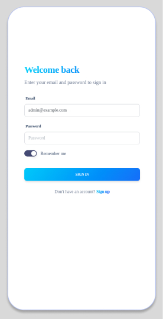

Seminar: OAuth2 with Laravel & VueJS
---

This application demonstrates how to use OAuth2 with Passport to secure a Laravel API. It also shows how to use VueJS to build a simple frontend for the API.
Here are some of the benefits of using this application:

- It is a simple and easy-to-understand example of how to use OAuth2 with Passport.
- It uses VueJS to build a simple and responsive frontend.
- It is a good starting point for building more complex applications that use OAuth2 with Passport and VueJS.

===

If you are interested in learning more about OAuth2, Passport, Laravel, or VueJS, I encourage you to check out the following resources:

- Laravel Passport documentation: https://laravel.com/docs/8.x/passport
- VueJS documentation: https://vuejs.org/v2/guide/
- OAuth2 tutorial: https://oauth.net/2/

===

I hope you find this application helpful!

===

